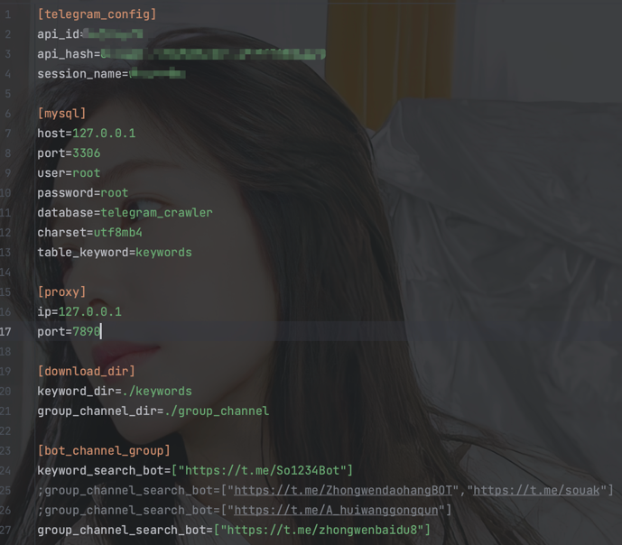

# telegram_crawler(telbot)
## telegram_crawler数据库结构
### mysql原来结构
这个是原来mysql的结构：

### mongodb迁移指南
```shell
# 先导出
docker exec -it xxxx /bin/bash
mongodump -u[username] -p[password] --authenticationDatabase admin 
# 再导入
docker exec -it xxxx /bin/bash
mongorestore -u[username] -p[password]--authenticationDatabase admin -d telegram_crawler /data/logs/telegram_crawler/telegram_crawler/
```
下面是4个collection的结构设计
### keywords集合
| _id | bot_name | crawl_time | keyword | search_times |
|-----|----------|------------|---------|--------------|
| xxx | bot名字    | 时间         | xxx     | n            |

### group_channel集合

| _id | bot_name | crawl_time | keyword | group_channel_url | have_searched_times |
|-----|----------|------------|---------|-------------------|---------------------|
| xxx | bot名字    | 时间         | 关键字     | 群组/频道url          |                     |

### history_message集合(message_date和message都经过str强转)

| _id | group_channel_url | message_id | message_date | message_text | message | is_application_media |
|-----|-------------------|------------|--------------|--------------|---------|----------------------|
| xxx | 群组/频道url          | 消息id       | 消息时间         | 消息内容         | 消息全部    | 是否存在apk/exe类型        |

### external_links集合

| _id | link | 
|-----|------|
| xxx | 外部链接 |

## 功能
1. 从telegram_bot中查询前99个热门关键词，写入本地文件和mysql数据库keywords表中；（也可以自己在config.ini设置关键词）
2. + 从数据库keywords表中查询最新获取的前99个热门关键词，然后在一些具有“搜群”的群组，输入关键词查询相关群组，最终把结果保存到本地文件和group_channel表中；
   + 从config.ini文件获取keywords（可自行设置） ，然后在一些具有“搜群”的群组，输入关键词查询相关群组，最终把结果保存到本地文件和group_channel表中；
3. 从第二步中爬取的group/channel爬取历史消息，适当保存id、日期、文本、如果存在应用类型的media给id打个标记，后续可以从该条消息直接下载附件；该步骤保存了message文本消息和原始message类型；
4. 从所有群组爬到的消息提取出外部链接并进行去重！
5. 模拟访问外链，下载应用（待完成）


## 使用教程
### socks5-代理搭建
感觉会用到这个：https://github.com/gao497290234/clash-for-linux  
由于我是在本机上面跑的，用的clash的默认端口7890
### mongodb
首先需要启动~~mysql~~(mongodb)数据库，需提前配置docker环境，然后进入到有docker-compose.yml的目录，执行下面命令即可（注意提前修改docker-compose.yml中mongodb的账号密码）  
``docker-compse up -d``
### 安装依赖
``pip install -r requirement.txt``
### config.ini配置(config.example.ini->config.ini)
**注意根据自己的实际情况配置,在config.ini增加配置后要到config.py添加相应的变量才能使用**  
[telegram_config]：需要去https://my.telegram.org/apps获取
[mongo]：mongo数据库的配置，注意和docker-mongo那边的一致  
[proxy]：telegram运行获取消息需要挂代理，clash默认7890端口  
[download_dir]：本地文件下载目录  
[bot_channel_group]：需要使用的bot/群组/频道  
[settings]：进行爬虫时的一些限制，例如点击次数、群组爬取限制、消息爬取限制


### 命令行使用
`python telbot`查看使用手册
```shell
echo "1. 首先获取99个keywords"
python3 telbot -k from_config

echo "2.1 从数据库获取关键字（默认99个），去查询group/channel"
python3 telbot -s from_collection

echo "2.2 从config.ini获取关键字（需自行添加），去查询group/channel"
python3 telbot -s from_config

echo "3. 从数据库获取group/channel，查询历史消息（默认200个，每个1000条）"
python3 telbot -m from_collection

echo "4. 从数据库获取历史消息，过滤出外链（默认200w条）"
python3 telbot -e from_collection
-------------------------------------------------
usage: telbot [-h] [-k {from_config}] [-s {from_collection,from_config}] [-m {from_collection}] [-e {from_collection}]

a bot for telegram_crawler.

options:
  -h, --help            show this help message and exit
  -k {from_config}, --keywords {from_config}
                        crawl 99 keywords from bot in config.ini.
  -s {from_collection,from_config}, --search_group_channel {from_collection,from_config}
                        crawl group/channel by sending keywords from collection/config.ini.
  -m {from_collection}, --history_message {from_collection}
                        crawl history_message from group/channel which is in collection.(最少访问优先爬取原则)
  -e {from_collection}, --external_links {from_collection}
                        extract external_links from history_message in collection.
```

## 后台运行 OR 定时启动
### screen后台运行
补充：可以不用定时启动，screen太香啦！
```shell
# 启动一个screen任务窗口
screen -S telegram_crawler
./telegram_crawler_run.sh
# 然后可以Ctrl+a+d挂在后台
# 查看全部screen任务
screen -ls
# 恢复screen窗口
screen -r {pid}
screen -r {task_name}
# 删除screen任务
exit
```
### 定时启动
```shell
# 先添加执行权限
chmod +x telegram_crawler_run.sh
# 设置定时启动命令
crontab -e
# 然后把当前路径的telegram_crawler_run.sh添加进去
0 0 * * * /path/to/telegram_crawler_run.sh
```

## 存在的一些问题
部分群组/频道已经不存在了  
  
~~部分message长度超过了1w限制（已经改大了）~~  
  
爬了一段时间的群组消息，11万条消息时候莫名奇妙被风控了，  

~~爬了11万条消息，发现没有一个是直接上传apk或者exe类型的？(原来是有的)~~  

发现每次爬取12万条消息就会开始报错（7.58个小时没了）；  


当数据库中消息的数量过多时，插入新的消息数据就会很慢，因为插入之前需要查询！  
