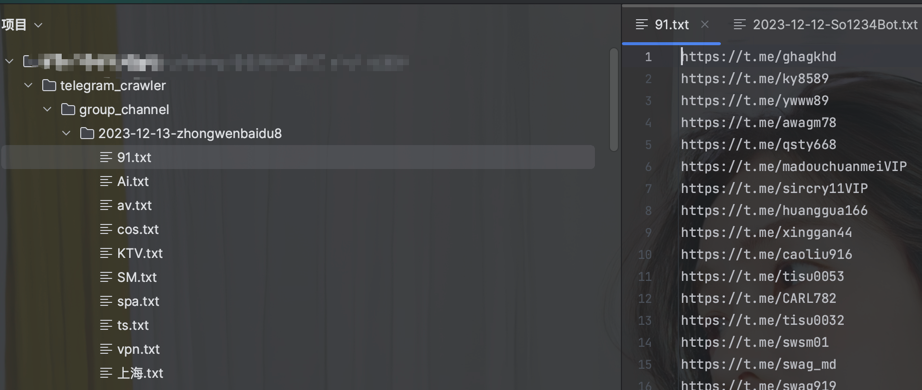

# telegram_crawler
## 功能
1. 从telegram_bot中查询前99个热门关键词，写入本地文件和mysql数据库keywords表中；（也可以自己在config.ini设置关键词）
2. + 从数据库keywords表中查询最新获取的前99个热门关键词，然后在一些具有“搜群”的群组，输入关键词查询相关群组，最终把结果保存到本地文件和group_channel表中；
   + 从config.ini文件获取keywords（可自行设置） ，然后在一些具有“搜群”的群组，输入关键词查询相关群组，最终把结果保存到本地文件和group_channel表中；
3. 从第二步中爬取的group/channel爬取历史消息，适当保存id、日期、文本、如果存在应用类型的media给id打个标记，后续可以从该条消息直接下载附件；该步骤保存了message文本消息和原始message类型；
4. 从所有群组爬到的消息提取出外部链接并进行去重！
5. （待完成）模拟访问外链，下载应用。

## 数量关系
理想状态：  
keyword:group_channel:message:external_links=1:40:40000:xxxx
第一次测试实际状态，中途被风控了(2023.12.13)：  
keyword:group_channel:message:external_links=99:3763:117226:848


## 样例展示
### 本地文本输出




### mysql数据库结构


## 使用教程
### socks5-代理搭建
感觉会用到这个：https://github.com/gao497290234/clash-for-linux  
由于我是在本机上面跑的，用的clash的默认端口7890
### 数据库-mysql
首先需要启动mysql数据库，需提前配置docker环境，然后进入到有docker-compose.yml的目录，执行下面命令即可（如果需要改变其他配置，可以到docker-compose.yml修改）  
``docker-compse up -d``
### 安装依赖
``pip install -r requirement.txt``
### config.ini配置(config.example.ini->config.ini)
**注意根据自己的实际情况配置,在config.ini增加配置后要到config.py添加相应的变量才能使用**  
[telegram_config]：需要去https://my.telegram.org/apps获取
[mysql]：mysql数据库的配置，注意和docker-mysql那边的一致  
[proxy]：telegram运行获取消息需要挂代理，clash默认7890端口  
[download_dir]：本地文件下载目录  
[bot_channel_group]：需要使用的bot/群组/频道  
[settings]：进行爬虫时的一些限制，例如点击次数、群组爬取限制、消息爬取限制


### 命令行使用
```
# 1. 获取99个关键词
python main.py keywords

# 2.1 根据第1步收集到的关键词搜索群组/频道（默认只点击一次下一页，一页20个共40个）
python main.py search_group_channel from_table

# 2.2 从config.ini获取keyword，然后去搜索群组/频道
python main.py search_group_channel from_config

# 3. 根据第2步收集的群组/频道，爬取他们的历史消息，默认是3960个群组/频道，每个限制1000条消息
python main.py history_message

# 4. 将第3步提取的message过滤出外链(默认是最新的20w条消息)
python main.py external_links

```

### 定时启动
```shell
# 先添加执行权限
chmod +x telegram_crawler_run.sh
# 设置定时启动命令
crontab -e
# 然后把当前路径的telegram_crawler_run.sh添加进去
0 0 * * * /path/to/telegram_crawler_run.sh
```

## 存在的一些问题
部分群组/频道已经不存在了  
  
~~部分message长度超过了1w限制（已经改大了）~~  
  
爬了一段时间的群组消息，11万条消息时候莫名奇妙被风控了，  

~~爬了11万条消息，发现没有一个是直接上传apk或者exe类型的？(原来是有的)~~  

发现每次爬取12万条消息就会开始报错（7.58个小时没了）；  


当数据库中消息的数量过多时，插入新的消息数据就会很慢，因为插入之前需要查询！  
